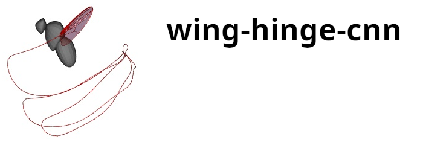

Software and Jupyter notebook for creating the muscle-to-wing motion CNN from
Melis, Siwanowicz, and Dickinson 2024. Contains code for generating data figures 3,
figure 4 and extended data figure 3.

### System Requirements

Tested on ubuntu 22.04 with Python 3.11.4

### Dependencies
The complete list of software dependencies can be found in the "dependencies"
section of the pyproject.toml file. All of the dependencies will be
automatically installed by the Package Installer for Python (pip) when the
software is installed.

### Installation
Requires a working installation of Python. To install cd into the source
Download source and cd into source directory. Then to install using pip run 

```bash
pip install .
```

or to install using [poetry](https://python-poetry.org/) run

```bash
poetry install
```

Software dependencies should be automatically downloaded during the
installation. 

Typical install time is 5-10min.

### Dataset and Jupyter notebook 

Download the required dataset, main_muscle_and_wing_data.h5, from CaltechDATA
[here](https://data.caltech.edu/records/aypcy-ck464) and place the file in
'notebook/dataset'.  

Run the notebook
```bash
jupyter notebook generate_figures.ipynb
```

### Training the wing hinge CNN 
An example script, train_wing_hinge_cnn.py, demonstrating how the neural
network is trained is provided in the 'examples' subdirectory.  

To run the example, download the required dataset,
main_muscle_and_wing_data.h5, from CaltechDATA
[here](https://data.caltech.edu/records/aypcy-ck464) and place the file the
'examples' subdirectory. Then run train_wing_hinge_cnn.py.   


